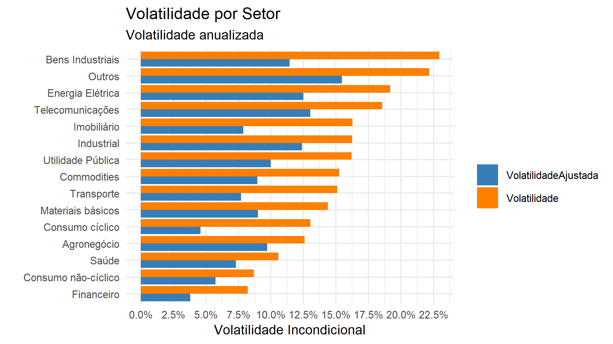

# Script para a apresentação do TCC

## Sobre a Coleta dos Dados

Inicialmente, optamos por coletar dados amostrais gratuitos de empresas listadas na bolsa de valores a partir do site Yahoo Finance. Esses dados continham os preços diários de negociação ajustados por eventos corporativos desde o ano 2000. No entanto, decidimos utilizar 01/01/2009 como ponto de partida. A escolha dessa data se deu intencionalmente, devido à alta volatilidade do mercado entre os anos 2000 e 2004, período marcado pelo processo de estabilização dos preços após o Plano Real.

Entre 2005 e 2007, enfrentamos uma baixa disponibilidade amostral de empresas listadas, dificultando a inclusão de todos os setores necessários para o nosso estudo. Nesse período, o mercado acionário brasileiro ainda estava em fase inicial de desenvolvimento, com um número significativo de IPOs ocorrendo apenas a partir de 2006 e 2007. Além disso, identificamos inconsistências nas amostras fornecidas pelo site Yahoo Finance até o ano de 2008, como preços ajustados negativos e retornos diários exorbitantes, sem os devidos ajustes por eventos corporativos.

Dada a escassez de acesso a fontes de dados gratuitas e confiáveis com o histórico necessário, reconhecemos que há potencial para aprimorar nosso estudo com amostras de maior qualidade.

Após a coleta inicial, classificamos as empresas em macro setores baseados em suas atividades. Utilizamos como base a categorização feita pela B3, realizando alguns ajustes para captar melhor a sensibilidade das atividades-fim das empresas às alterações de política monetária. A B3 classifica as empresas listadas em 13 setores e 118 subsetores, que, após nossa reclassificação, resultaram em 15 setores. Os critérios usados para nossa classificação incluíram:

1. Agrupar os setores “Comunicações” e “Tecnologia da Informação” como “Telecomunicações”.
2. Separar o setor “Agronegócio” dos relacionados às demais commodities.
3. Diferenciar empresas que produzem bens usados na indústria daquelas que fabricam bens finais.
4. Separar o setor de “Energia Elétrica” do setor “Utilidade Pública”.
5. Criar um setor específico para o “Imobiliário”.

Essa reclassificação nos permitiu analisar de forma mais precisa a resposta de cada setor às variações na política monetária

## Sobre a construção do índice de mercado

Para avaliarmos o comportamento idiossincrático dos setores, precisamos estudar suas variações além da variação do mercado como um todo. Para isso, foi necessário construir um índice de mercado personalizado, utilizando nossa base de dados e uma metodologia diferente daquela empregada pela B3. A metodologia da B3 dá pesos relevantes a poucos setores, como minério de ferro, petróleo e bancos, o que poderia distorcer nossa análise.

Além do índice de mercado geral, também elaboramos um índice específico para cada setor anteriormente classificado. Para a construção desses índices, consideramos dois critérios principais: a classificação das empresas por pesos iguais e a classificação por volume de negociação, utilizando janelas de 12 meses atualizadas a cada pregão. Optamos por realizar um teste de robustez entre essas duas metodologias para determinar qual apresentava melhor comportamento estatístico.

Utilizamos o teste de JackKnife para excluir cada setor da amostra e analisar o impacto dos dados restantes ao longo do período de janeiro de 2014 até março de 2024. Cada exclusão gerava até 800 iterações, permitindo-nos avaliar qual das estruturas apresentava menor variabilidade após a retirada de uma parte da amostra, indicando maior robustez.

Os resultados do teste foram favoráveis ao método de ponderação por volume de negociação, com janelas de 12 meses para cada pregão. Observamos que tanto o viés quanto o erro padrão desse método eram menores em comparação com o método de pesos iguais. Assim, decidimos compor os índices setoriais baseando-nos no volume de negociação anual, ajustado pelo logaritmo natural de cada ação, evitando que empresas com participação regular e relevante nos pregões tivessem uma importância desproporcional.

Essa abordagem nos permitiu criar um índice de mercado e índices setoriais que refletem de forma mais precisa as variações específicas de cada setor, proporcionando uma análise mais robusta e confiável do comportamento idiossincrático dos setores estudados.

## Sobre o cálculo da taxa de juros

Para avaliarmos as alterações na política monetária, optamos por usar as taxas negociadas do DI futuro de 1 ano, com uma duração de 252 dias úteis. Esse enfoque nos permite capturar as expectativas do mercado em relação às mudanças na política monetária de maneira mais eficaz.

Utilizamos uma metodologia de interpolação semelhante à Estrutura a Termo das Taxas de Juros Estimada (ETTJ), empregada pela Anbima. Esta metodologia é baseada no Modelo de Nelson e Siegel (1987), que nos permite interpolar as taxas entre diversos contratos de DIs com diferentes vencimentos. Dessa forma, conseguimos obter uma taxa diária de DI futuro com vencimento em 1 ano (252 dias úteis).

Essa abordagem possibilita uma análise mais precisa da expectativa do mercado em relação às taxas de juros futuras. Além disso, ao utilizar a metodologia de interpolação, aumentamos a variabilidade dos dados no estudo, o que é essencial para o tratamento da volatilidade através dos modelos GARCH.

Dessa maneira, ao calcularmos a taxa de juros diária do DI futuro com vencimento em 1 ano, conseguimos uma medida robusta que reflete tanto as expectativas do mercado quanto a volatilidade inerente às taxas de juros. Isso é fundamental para a nossa análise das mudanças na política monetária e seus impactos nos diversos setores econômicos.

## Sobre a taxa de câmbio real

A taxa de câmbio (USDBRL) real pode afetar direta ou indiretamente o mercado e os setores da economia. De modo geral, a taxa de câmbio real de um país pode incentivar ou desincentivar o fluxo de capital estrangeiro para investimentos nessa economia e, portanto, também influenciar os preços das ações na bolsa de valores. No caso do mercado acionário brasileiro, onde o capital estrangeiro exerce grande participação nas negociações diárias, esse efeito é ainda mais significativo. A participação dos estrangeiros nos pregões atingiu uma média de 50,31% no período de 2019 até 2023, de acordo com a B3.

Além disso, o câmbio gera impactos financeiros na economia real das empresas, seja através de sua atividade-fim ou através de seus custos. As empresas de commodities são diretamente impactadas devido à dinâmica de preços frente ao dólar, que são inversamente correlacionados. Essa dinâmica foi corroborada por Rodrigo Branco em seu artigo, onde ele indica que há uma correlação significativa entre a evolução do índice de preços internacionais das commodities e a taxa de câmbio brasileira. O câmbio também influencia diretamente os custos do setor de transporte através do preço dos combustíveis, além de afetar os produtos importados na economia. Esse impacto é sentido no setor industrial, devido ao custo da matéria-prima e da importação de tecnologia, bem como nos setores de consumo cíclico (principalmente turismo e bens importados) e de consumo não-cíclico (especialmente alimentos e bebidas, influenciados pela dinâmica entre commodity e dólar).

Diante disso, identificamos que o câmbio tem impactos variados nos diversos setores da economia. Usamos a taxa de câmbio real (USDBRL), que considera tanto a inflação brasileira (IPCA) quanto a inflação dos Estados Unidos (CPI Index), para evitar vieses no modelo autorregressivo estudado devido ao seu efeito na volatilidade do mercado. Essa abordagem é importante porque a taxa de câmbio real pode ser uma variável relevante no nosso modelo de estudo.

Os dados de inflação (IPCA) e taxa de câmbio nominal (PTAX) foram coletados do site do Banco Central do Brasil, enquanto os dados de inflação norte-americana (CPI Index) foram coletados do site do FED (Federal Reserve – Banco Central dos EUA).

## Sobre a taxa de juros americana

As remunerações das Treasuries (títulos públicos do governo estado-unidense) possuem alta relevância nos mercados internacionais devido ao seu baixo risco de crédito e sua remuneração em dólares, a moeda considerada globalmente como reserva de valor. Esses títulos são usados como parâmetro para Ativo Livre de Risco por diversos países, não apenas pelo setor privado, mas também pelo setor público, que utiliza esses títulos como reservas internacionais, como é o caso do Brasil. Devido à sua importância nas comparações entre taxas de renda fixa em todo o mundo, mudanças nas remunerações das Treasuries afetam as taxas de juros das demais economias e, portanto, também afetam o prêmio de risco exigido ao investir em ativos de risco.

Dessa forma, identificamos uma possível influência da taxa de juros dos EUA nos preços da bolsa de valores brasileira, através do incentivo ou desincentivo aos investimentos pelos agentes, de acordo com seu custo de oportunidade. Além disso, há uma relação indireta entre a taxa de juros dos EUA e a taxa de câmbio (USDBRL), uma vez que mudanças nas remunerações das Treasuries podem afetar o fluxo de entrada e saída de recursos da bolsa brasileira por investidores estrangeiros, influenciando assim a taxa de câmbio.

Assim como fizemos com a taxa de juros brasileira através da metodologia Nelson-Siegel, também utilizamos essa metodologia para estimar a expectativa da taxa de juros dos EUA. Os dados foram elaborados através da interpolação das diferentes remunerações dos títulos públicos americanos (Treasuries) que possuem pagamento de cupom, conforme a metodologia da série de tempo Nominal Yield Curve. Esses dados estão disponíveis no site institucional do Federal Reserve.

Ao utilizar essa abordagem, conseguimos capturar melhor as expectativas do mercado em relação às taxas de juros dos EUA e suas implicações nos mercados internacionais. Esse entendimento é crucial para a nossa análise, pois nos permite considerar a influência das taxas de juros americanas sobre os preços dos ativos na bolsa brasileira, além de seu impacto sobre a taxa de câmbio e a volatilidade do mercado.

## Sobre os modelos de volatilidade

Para atingir os objetivos delineados neste estudo, utilizamos métodos econométricos amplamente reconhecidos. Inicialmente, aplicamos os modelos GARCH (Generalized Autoregressive Conditional Heteroskedasticity) para examinar a volatilidade condicional nas séries temporais financeiras. Esses modelos são eficazes para acompanhar as variações de volatilidade ao longo de diversos períodos, pois consideram tanto a variância histórica quanto os demais valores da série temporal heterocedástica. Essa abordagem é adequada para avaliar a volatilidade dos setores na bolsa de valores.

No entanto, para capturar de forma mais precisa a interação entre a política monetária e a volatilidade setorial, e para remover os efeitos não específicos das empresas na volatilidade, optamos por implementar o modelo DCC-GARCH (Dynamic Conditional Correlation GARCH). Este modelo nos permite analisar as correlações dinâmicas entre os setores da bolsa, oferecendo uma representação mais acurada da volatilidade condicional e das correlações ao longo do tempo.

O modelo DCC-GARCH é particularmente útil para nossa análise, pois auxilia na compreensão da estrutura de correlação entre os diferentes setores. Essa compreensão é crucial para identificar como os setores reagem de forma interdependente às alterações na política monetária. Em resumo, o uso do DCC-GARCH nos proporciona uma visão mais detalhada e dinâmica das relações de volatilidade entre os setores, permitindo uma análise mais robusta e informada das interações entre política monetária e volatilidade setorial.

## Sobre a derivação do CAPM

Para discernir o impacto das alterações da política monetária nos setores em relação ao mercado, utilizamos o Modelo de Precificação de Ativos de Capital (CAPM). Este modelo nos ajuda a segregar do risco total do setor (\(t\)) qual parcela é risco de mercado (\(m\)) e qual é de fato o risco peculiar à empresa (\(\epsilon\)):

$r_t = r_f + \beta \times (r_m - r_f) + \epsilon \quad (1)$

Consideramos o Ativo Livre de Risco ($r_f$) igual a zero na equação (1), visto que nosso foco é obter o Beta do Setor em relação ao Mercado:

$r_t = \beta \times r_m + \epsilon \quad (2)$

A propriedade de variância é expressa na equação (3):

$\text{var}(r_t) = \text{var}(\beta \times r_m + \epsilon) \quad (3)$

Aplicamos a propriedade de multiplicação de variância por constante na equação (3):

$\text{var}(\beta \times r_m) = \beta^2 \times \sigma_m^2 \quad (4)$

A partir da equação (4), aplicamos a propriedade de soma de variâncias:

$\text{var}(\beta \times r_m + \epsilon) = \text{var}(\beta \times r_m) + \text{var}(\epsilon) + \text{cov}(\beta \times r_m, \epsilon) \quad (5)$

Por tratar-se de erro, assumimos na equação (5) que:

$\text{cov}(\beta \times r_m, \epsilon) = 0$

Resultando na equação (6):

$\text{var}(\beta \times r_m + \epsilon) = \text{var}(\beta \times r_m) + \text{var}(\epsilon) \quad (6)$

Ou, podemos expressar através da equação (7):

$\beta^2 \times \sigma_m^2 + \sigma^2 \quad (7)$

Portanto, a variância total do setor é vista na equação (8):

$\sigma_t^2 = \beta^2 \times \sigma_m^2 + \sigma_\epsilon^2 \quad (8)$

A partir da equação (8), isolamos aritmeticamente o \(\sigma_\epsilon^2\):

$\sigma_\epsilon^2 = \sigma_t^2 - \beta^2 \times \sigma_m^2 \quad (9)$

Finalmente, chegamos à variância idiossincrática do setor vista na equação (10):

$\sigma_\epsilon = \sqrt{\sigma_t^2 - \beta^2 \times \sigma_m^2} \quad (10)$

Estes passos nos permitem expurgar da análise a volatilidade geral do mercado, focando apenas na volatilidade setorial que pode ser atribuída às respostas individuais das empresas cujas atividades-fim sofrem diferentes impactos mediante alterações na política monetária.

Na Figura 8, a “Volatilidade” representa a volatilidade total do setor, enquanto a “Volatilidade Ajustada” representa a volatilidade explicada individualmente pelo respectivo setor, ou seja, sem o impacto da volatilidade do mercado sobre sua variância."

## Sobre o uso do VAR

O modelo VAR (Vector Autoregression) examina relações lineares entre cada variável e seus próprios valores defasados, bem como os de todas as demais variáveis, impondo como restrições somente a escolha do conjunto relevante de variáveis e do número máximo de defasagens envolvidas nas relações entre elas. Empregamos o modelo VAR para investigar as relações entre as variáveis de política monetária (variável independente) e a volatilidade dos setores (variável dependente), além de fazer o controle pela Taxa de Câmbio Real e Taxa de Juros dos EUA (variáveis independentes), que podem interferir na volatilidade específica dos setores devido às interações abordadas anteriormente.

O VAR é valorizado por sua capacidade de mapear relações entre séries temporais diversas, permitindo-nos perceber as repercussões tanto imediatas quanto de longo prazo das intervenções monetárias na volatilidade dos setores do mercado. Essa capacidade de analisar as interações dinâmicas entre múltiplas variáveis temporais é essencial para entender como mudanças na política monetária influenciam a volatilidade setorial.

A combinação das metodologias GARCH, DCC-GARCH, CAPM e VAR proporcionará uma representação mais completa e precisa da volatilidade dos setores da bolsa frente às mudanças na política monetária. Cada uma dessas metodologias oferece uma perspectiva única sobre a volatilidade:

- GARCH: Captura a volatilidade condicional ao longo do tempo.
- DCC-GARCH: Analisa as correlações dinâmicas entre os setores.
- CAPM: Segrega o risco de mercado do risco idiossincrático.
- VAR: Examina as relações lineares entre as variáveis de política monetária e a volatilidade setorial.

Durante as etapas de análise, é crucial garantir a acurácia dos modelos, monitorando continuamente para detectar e ajustar possíveis inconsistências nos resíduos, assegurando a confiabilidade das descobertas. Dessa forma, conseguimos uma análise robusta e detalhada das interações entre política monetária e volatilidade setorial, oferecendo insights valiosos para a compreensão das dinâmicas do mercado
